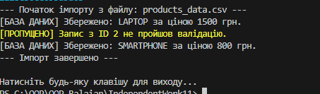

# Самостійна робота №16: Схема розподілу відповідальностей модуля

## Варіант №13: DataImporter (CSV -> Validation -> Transform -> DB)

### Мета роботи
Навчитися застосовувати принцип єдиної відповідальності (**SRP**) для декомпозиції складного модуля на менші, спеціалізовані класи, а також візуалізувати архітектуру за допомогою UML-діаграм.

### Опис завдання
Реалізовано систему імпорту даних, яка раніше була представлена одним "God Object" класом. Після рефакторингу кожна операція (читання, перевірка, перетворення, збереження) винесена в окремий сервіс, що працює через інтерфейс.

### Архітектура (SRP Декомпозиція)

Згідно з принципом інверсії залежностей (**DIP**), головний сервіс `DataImportService` не залежить від конкретних реалізацій, а працює з абстракціями:

1. **ICsvReader** — відповідає лише за видобування сирих даних з джерела.
2. **IDataValidator** — містить логіку перевірки даних на коректність.
3. **IDataTransformer** — відповідає за мапінг та перетворення типів (string -> int/decimal).
4. **IDataRepository** — відповідає за фінальне збереження даних.



### UML Діаграма класів


```mermaid
classDiagram
    class DataImportService {
        -ICsvReader _reader
        -IDataValidator _validator
        -IDataTransformer _transformer
        -IDataRepository _repository
        +ExecuteImport(string path)
    }
    class ICsvReader { <<interface>> +Read(path) }
    class IDataValidator { <<interface>> +IsValid(data) }
    class IDataTransformer { <<interface>> +Transform(data) }
    class IDataRepository { <<interface>> +Save(data) }

    DataImportService --> ICsvReader
    DataImportService --> IDataValidator
    DataImportService --> IDataTransformer
    DataImportService --> IDataRepository


