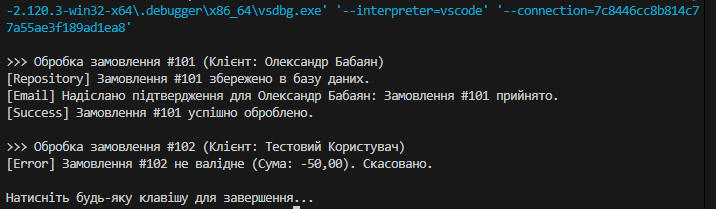

Звіт до лабораторної роботи №20
Обґрунтування рефакторингу (SRP)
Початкова ідея OrderProcessor, який робить все сам, є анти-патерном God Object. Порушення SRP призводить до того, що зміна логіки відправки пошти змушує нас переписувати клас, який відповідає за збереження в базу.

Після рефакторингу:

IOrderValidator: Відповідає виключно за бізнес-правила (валідацію).

IOrderRepository: Відповідає виключно за збереження та отримання даних (Persistence).

IEmailService: Відповідає виключно за комунікацію з клієнтом.

OrderService: Виконує роль оркестратора. Він не знає, як саме валідувати чи куди зберігати, він лише керує процесом.

Переваги такого підходу:
Тестованість: Ми можемо легко протестувати OrderService, передавши йому "фейкові" (mock) версії інтерфейсів.

Гнучкість: Якщо ми захочемо змінити ConsoleEmailService на SmtpEmailService, нам не доведеться змінювати жодного рядка коду в OrderService.

Чистота: Кожен клас став коротким, зрозумілим і має лише одну причину для зміни.

Приклад роботи
