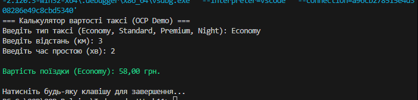

Звіт до лабораторної роботи №21
Тема: Застосування OCP для служби таксі.
Реалізація:

Інтерфейс ITaxiStrategy: Визначає контракт для всіх майбутніх тарифів.

Конкретні стратегії: Economy, Standard, Premium.

Розширюваність: Додано NightTaxiStrategy. Демонструє, що для підтримки нічних поїздок не потрібно модифікувати логіку TaxiRideService.

Dependency Injection: Стратегія передається в метод сервісу, що робить систему гнучкою в рантаймі.

Приклад роботи
