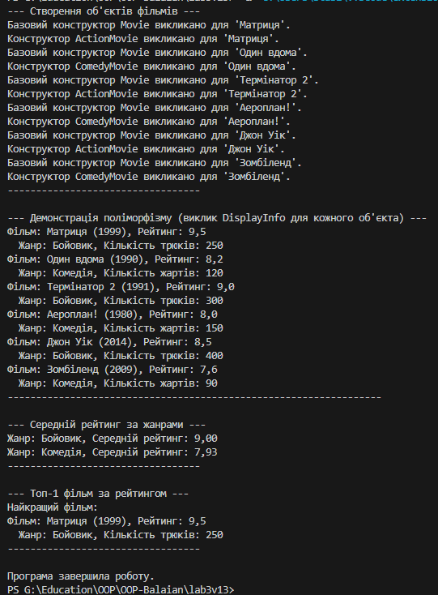

Звіт до Лабораторної роботи 3: Успадкування та Поліморфізм

	Студент: Балаян Станіслав
	Варіант: 13
	Тема: Фільми (Movie, ActionMovie, ComedyMovie)
	Дата: 05-10-2025р

1. Мета роботи

Метою роботи було ознайомлення та практичне застосування принципів успадкування та поліморфізму в C#. Зокрема, необхідно було реалізувати базовий клас та мінімум два похідні, продемонструвати використання конструкторів базового класу, перевизначення методів, а також поліморфізм на колекції об'єктів. Додатково було реалізовано обчислення середнього рейтингу за жанрами та пошук топ-1 фільму.

2. Опис виконання завдання

2.1. Структура класів

Були створені наступні класи:
- `Movie` (базовий клас): Має поля `_title`, `_releaseYear`, `_rating`. Надає публічні властивості (`Title`, `ReleaseYear`, `Rating`) з базовою валідацією. Містить віртуальні методи `DisplayInfo()` для виведення загальної інформації та `GetGenre()` для визначення жанру.
- `ActionMovie` (похідний клас): Успадковує від `Movie`. Додає властивість `StuntCount`. Перевизначає `DisplayInfo()` для виведення специфічної інформації про бойовики та `GetGenre()` для повернення "Бойовик".
- `ComedyMovie` (похідний клас): Успадковує від `Movie`. Додає властивість `LaughCount`. Перевизначає `DisplayInfo()` для виведення специфічної інформації про комедії та `GetGenre()` для повернення "Комедія".

2.2. Конструктори

Кожен похідний клас (`ActionMovie`, `ComedyMovie`) має конструктор, який викликає конструктор базового класу `Movie` за допомогою ключового слова `base(...)`, щоб ініціалізувати успадковані властивості.

2.3. Перевизначення методів (virtual/override)

Методи `DisplayInfo()` та `GetGenre()` у базовому класі `Movie` оголошені як `virtual`. У похідних класах (`ActionMovie`, `ComedyMovie`) ці методи перевизначені (`override`), щоб надати специфічну для кожного жанру логіку виведення інформації та повернення назви жанру.

2.4. Поліморфізм на колекції об'єктів

У методі `Main` була створена колекція `List<Movie>`. В цю колекцію додавалися об'єкти як `ActionMovie`, так і `ComedyMovie`. При ітерації по колекції та виклику `movie.DisplayInfo()`, завдяки поліморфізму, для кожного об'єкта викликалася коректна, перевизначена версія методу `DisplayInfo()` з відповідного похідного класу.

2.5. Обчислення

Була реалізована логіка для:
- Середнього рейтингу за жанрами: Використано LINQ-методи `GroupBy` та `Average` для групування фільмів за жанром (отриманим через поліморфний `GetGenre()`) та обчислення середнього рейтингу для кожного жанру.
- Топ-1 фільму: Використано LINQ-метод `OrderByDescending` та `FirstOrDefault` для знаходження фільму з найвищим рейтингом.

3. Приклади запуску

3.1. Створення об'єктів та виклик конструкторів
