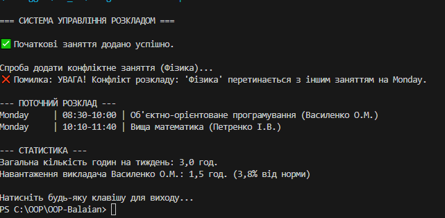

# Лабораторна робота №5: Узагальнені типи, колекції та LINQ

## Варіант №13: Розклад занять (Schedule/Lesson)

### 📝 Опис завдання
Програма призначена для керування розкладом занять. Вона дозволяє додавати нові заняття, перевіряти їх на предмет часових конфліктів (перетинів) та розраховувати статистику навантаження.

### 🏗 Архітектура та технічні особливості
У проєкті реалізовано:
* **Generics (Узагальнення):** Створено універсальний репозиторій `Repository<T>`, який може працювати з будь-яким типом даних.
* **Композиція:** Клас `Schedule` містить у собі об'єкт `Repository<Lesson>`, що забезпечує слабке зв'язування.
* **LINQ:** Використовується для фільтрації даних (`Where`), перевірки умов (`Any`) та проведення розрахунків (`Sum`).
* **Обробка винятків:** Реалізовано власний клас винятку `TimeOverlapException`, який спрацьовує при спробі додати заняття на той самий час.

### 🚀 Функціональні можливості
1. Додавання занять з автоматичною валідацією часу.
2. Розрахунок загальної кількості навчальних годин на тиждень.
3. Обчислення відсоткового навантаження для конкретного викладача.
4. Пошук занять за допомогою предикатів.

### 💻 Приклад роботи програми
Після запуску програма намагається додати кілька занять. Якщо час занять перетинається, система виведе попередження:

> **Скриншот виводу:**
> 

---

### 🛠 Як запустити
1. Переконайтеся, що у вас встановлено **.NET 6.0 SDK** або вище.
2. Склонуйте репозиторій або скопіюйте файли.
3. Відкрийте термінал у папці проєкту.
4. Виконайте команду:
   bash
   dotnet run