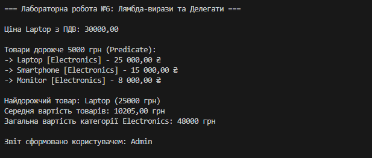

# Лабораторна робота №6: Лямбда-вирази, анонімні функції та делегати

## Варіант №1: Облік товарів (Product)

### Мета роботи
Закріпити практичні навички роботи з делегатами (`delegate`), подіями та вбудованими типами делегатів (`Func<>`, `Action<>`, `Predicate<>`). Навчитися застосовувати лямбда-вирази для лаконічної обробки колекцій за допомогою LINQ.

### Опис завдання
Реалізовано приклад системи керування списком товарів (`Product`), що мають назву, ціну та категорію. Програма демонструє:
1. **Фільтрацію** товарів за ціною за допомогою `Predicate<T>`.
2. **Пошук** найдорожчого товару через сортування `OrderByDescending`.
3. **Обчислення** середньої вартості та загальної суми за категоріями через `Func<T, TResult>`.
4. **Форматований вивід** результатів за допомогою `Action<T>`.

### Використані технології
* **Custom Delegates:** Власний делегат `PriceOperation` для розрахунку податків.
* **Anonymous Methods:** Використання ключового слова `delegate` для створення методів "на льоту".
* **Lambda Expressions:** Скорочений запис функцій для передачі в LINQ-методи.
* **Built-in Delegates:**
    * `Predicate<Product>` — для логічних перевірок (фільтрація).
    * `Action<Product>` — для виконання дій над об'єктами (друк).
    * `Func<Product, double>` — для перетворення об'єктів у числові значення (агрегація).
* **LINQ:** Методи `Where`, `Select`, `Average`, `Sum`, `OrderByDescending`.

### Приклад виводу програми
